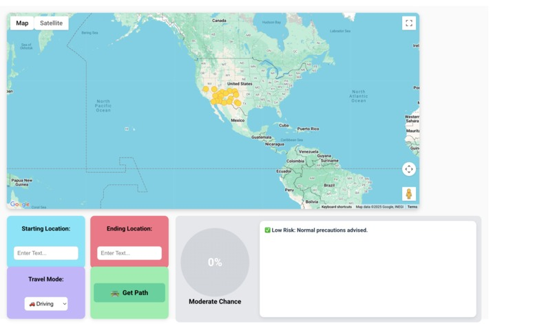
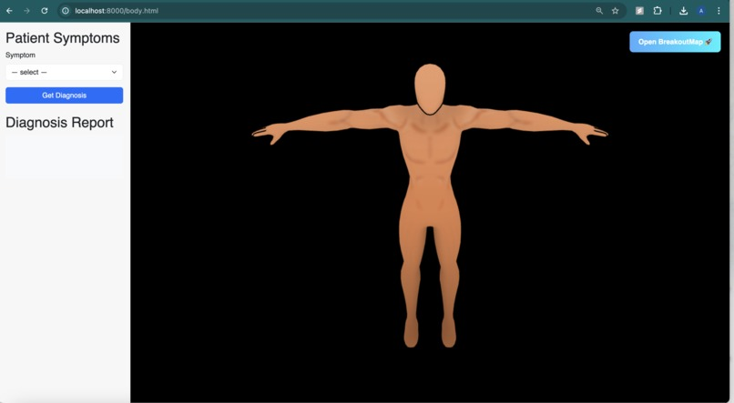

# 🩺 **Measles Diagnostic 3D Viewer**

**An innovative medical diagnostic tool combining 3D visualization, AI recommendations, and interactive symptom recording.**  
Designed to assist healthcare professionals in evaluating and documenting symptoms like rash, fever, and conjunctivitis with precision.

---

## 🖼 **Project Images**






---

## 🚀 **Key Features**

✅ **3D Body Model Viewer**  
Interactive **Three.js** environment to explore and mark body parts for symptoms.

✅ **Symptom Recording**  
Log symptoms by body part, select symptom type, describe visually, and upload supporting images/audio.

✅ **AI-Driven Diagnosis**  
Integrated Gemini AI API for quick, dynamic risk assessment and follow-up guidance.

✅ **Data Persistence**  
Flask API captures and stores diagnostic data for review and analytics.

✅ **Responsive UI**  
User-friendly interface for both desktop and mobile.

✅ **Secure File Handling**  
Handles uploaded images and audio for comprehensive symptom documentation.

---

## 🛠 **Tech Stack**

| Layer | Technologies |
|--------|--------------|
| **Frontend** | HTML, CSS, JavaScript, Three.js (3D visualization), Spline (optional) |
| **Backend** | Python, Flask, Flask-CORS |
| **AI / ML** | Google Gemini API (diagnosis suggestions) |
| **Database / Files** | Local JSON storage for routes, uploaded files in `data/` directory |

---

## ⚙ **How to Run Locally**

### 1️⃣ **Clone the repository**
```bash
git clone [your-repo-url]
cd measles-diagnostic-viewer
```

### 2️⃣ **Set up the backend**
```bash
python -m venv venv
source venv/bin/activate  # On Windows: venv\Scripts\activate
pip install -r requirements.txt
```
Ensure your `.env` file contains the Gemini API key:
```
GEMINI-KEY=your_api_key_here
```
Run the Flask app:
```bash
python app.py
```

### 3️⃣ **Serve the frontend**
Open `index.html` in a browser, or use:
```bash
python -m http.server
```
for a local static server.

---

## 📂 **Project Structure**
```
📁 backend/
 └── app.py (Flask API)
📁 data/
 └── Saved JSON files
📁 frontend/
 ├── index.html
 ├── body.js (3D Viewer logic)
 └── styles.css (if used)
📄 .env (API keys)
📄 requirements.txt
```

---

## 🌟 **Planned Enhancements**
- 🌐 Cloud storage for uploaded images/audio
- 🔔 Real-time notifications for critical diagnoses
- 🧠 Advanced ML-based risk scoring
- 🌓 Dark mode toggle for UI
